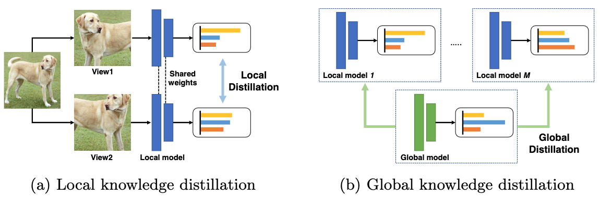

# PytorchResearchCodesReading
An organized list of open source code for some research papers I have read.

> Almost all the source files of the paper can be found in the local zotero


## Benchmark

LEAF: A Benchmark for Federated Settings

[code](https://github.com/TalwalkarLab/leaf)

### Resources
Homepage: [leaf.cmu.edu](https://leaf.cmu.edu/)

Paper: ["LEAF: A Benchmark for Federated Settings"](https://arxiv.org/abs/1812.01097)


# Euclidean spatial data

## easyFL

[code](https://github.com/JevenM/easyFL)

Implementation of multiple basic federated learning algorithms.


## federated-learning-with-pytorch

This repo contains code for training models in a federated fashion using PyTorch and Slurm. This includes simple local training, federated averaging, and personalization. Moreover, this repo reproduces the results of the paper [Certified Robustness in Federated Learning](https://arxiv.org/pdf/2206.02535.pdf) Preprint.

[code](https://github.com/motasemalfarra/federated-learning-with-pytorch)

## FedProto

Implementation of the paper accepted by (AAAI 2022) [FedProto: Federated Prototype Learning across Heterogeneous Clients]().

[code](https://github.com/yuetan031/FedProto)

## MOON

This is the code for paper [Model-Contrastive Federated Learning](https://arxiv.org/pdf/2103.16257.pdf)

[code](https://github.com/QinbinLi/MOON)

Abstract: Federated learning enables multiple parties to collaboratively train a machine learning model without communicating their local data. A key challenge in federated learning is to handle the heterogeneity of local data distribution across parties. Although many studies have been proposed to address this challenge, we find that they fail to achieve high performance in image datasets with deep learning models. In this paper, we propose MOON: model-contrastive federated learning. MOON is a simple and effective federated learning framework. The key idea of MOON is to utilize the similarity between model representations to correct the local training of individual parties, i.e., conducting contrastive learning in model-level. Our extensive experiments show that MOON significantly outperforms the other state-of-the-art federated learning algorithms on various image classification tasks.


### Tiny-ImageNet

You can download Tiny-ImageNet [here](http://cs231n.stanford.edu/tiny-imagenet-200.zip). Then, you can follow the [instructions](https://github.com/AI-secure/DBA/blob/master/utils/tinyimagenet_reformat.py) to reformat the validation folder.


## SSKD

The implementation of paper [Knowledge Distillation Meets Self-Supervision]() (ECCV 2020).
<!--  -->

<center> </center>

[code](https://github.com/xuguodong03/SSKD)


## FedX

The PyTorch code of paper [FedX: Unsupervised Federated Learning with Cross Knowledge Distillation](https://arxiv.org/abs/2207.09158) (ECCV 2022).

The authors propose an unsupervised federated learning algorithm, FedX, that learns data representations via a unique two-sided knowledge distillation at local and global levels.



### Overall model architecture


[code](https://github.com/Sungwon-Han/FEDX)


## CRD

The implementation of the following ICLR 2020 paper [Contrastive Representation Distillation (CRD)](http://arxiv.org/abs/1910.10699), [Project Page](http://hobbitlong.github.io/CRD/).

[code](https://github.com/HobbitLong/RepDistiller)

<center></center>


## FedSkip

The code for paper(ICDM22 Regular Paper) [FedSkip: Combatting Statistical Heterogeneity with Federated Skip Aggregation].

[code](https://github.com/MediaBrain-SJTU/FedSkip)


## FedClassAvg

The implementation of the paper [FedClassAvg: Local Representation Learning for Personalized Federated Learning on Heterogeneous Neural Networks]() (ICPP 2022)

[code](https://github.com/hukla/FedClassAvg)


## MEAL-V2

The official pytorch implementation of our paper [MEAL V2: Boosting Vanilla ResNet-50 to 80%+ Top-1 Accuracy on ImageNet without Tricks]()

[code](https://github.com/szq0214/MEAL-V2)


In this paper, we introduce a simple yet effective approach that can boost the vanilla ResNet-50 to 80%+ Top-1 accuracy on ImageNet without any tricks. Generally, our method is based on the recently proposed MEAL, i.e., ensemble knowledge distillation via discriminators. We further simplify it through 1) adopting the similarity loss and discriminator only on the final outputs and 2) using the average of softmax probabilities from all teacher ensembles as the stronger supervision for distillation. One crucial perspective of our method is that the one-hot/hard label should not be used in the distillation process. We show that such a simple framework can achieve state-of-the-art results without involving any commonly-used tricks, such as 1) architecture modification; 2) outside training data beyond ImageNet; 3) autoaug/randaug; 4) cosine learning rate; 5) mixup/cutmix training; 6) label smoothing; etc.


## FLIS

The official code of paper [FLIS: Clustered Federated Learning via Inference Similarity for Non-IID Data Distribution](https://arxiv.org/pdf/2208.09754.pdf)

[code](https://github.com/MMorafah/FLIS).

"Accepted to FL NeurIPS workshop 2022".

In this repository, we release the official implementation for FLIS algorithms (FLIS-DC, FLIS-HC). The algorithms are evaluated on 4 datasets (Cifar-100/10, Fashion-MNIST, SVHN) with non-iid label distribution skew (noniid-#label2, noniid-#label3, noniid-labeldir).


### Acknowledgements
Some parts of our code and implementation has been adapted from [NIID-Bench](https://github.com/Xtra-Computing/NIID-Bench) repository.


## NIID-Bench

This is the code of paper [Federated Learning on Non-IID Data Silos: An Experimental Study]()

[code](https://github.com/Xtra-Computing/NIID-Bench).

This code runs a benchmark for federated learning algorithms under non-IID data distribution scenarios. Specifically, we implement 4 federated learning algorithms (FedAvg, FedProx, SCAFFOLD & FedNova), 3 types of non-IID settings (label distribution skew, feature distribution skew & quantity skew) and 9 datasets (MNIST, Cifar-10, Fashion-MNIST, SVHN, Generated 3D dataset, FEMNIST, adult, rcv1, covtype).

## DisTrans

The repository for [Addressing Heterogeneity in Federated Learning via Distributional Transformation](https://link.springer.com/10.1007/978-3-031-19839-7_11) (ECCV 2022)

[code](https://github.com/hyhmia/DisTrans)

DisTrans is a novel generic framework designed to improve federated learning(FL) under various level of data heterogeneity using a double-input-channel model structure and a carefully optimized offset.


The global model in FL setting with DisTrans learns better features than with state-of-the-art (SOTA) methods and thus gets higher accuracy.


We perform extensive evaluation of DisTrans using five different image datasets and compare it against SOTA methods. DisTrans outperforms SOTA FL methods across various distributional settings of the clients' local data by 1%--10% with respect to testing accuracy. Moreover, our evaluation shows that \sys achieves 1%--7% higher testing accuracy than data transformation (or augmentation), i.e., mixup and AdvProp.

For more details of our method and evaluations, please refer to Section 5 of the paper.


## mean-teacher

Implement for paper [Mean teachers are better role models](https://arxiv.org/abs/1703.01780).

[code](https://github.com/CuriousAI/mean-teacher)

[NIPS 2017 poster](https://github.com/CuriousAI/mean-teacher/blob/master/nips_2017_poster.pdf) ---- [NIPS 2017 spotlight slides](https://github.com/CuriousAI/mean-teacher/blob/master/nips_2017_slides.pdf) ---- [Blog post](https://thecuriousaicompany.com/mean-teacher/)


## ONE

This is an Pytorch implementation of Xu et al. [Knowledge Distillation On the Fly Native Ensemble (ONE)](https://arxiv.org/pdf/1806.04606.pdf) NeurIPS 2018 on Python 2.7, Pytorch 2.0. You may refer to our Vedio and Poster for a quick overview.

NeurIPS 2018

> learnable aggregate model

[code](https://github.com/Lan1991Xu/ONE_NeurIPS2018)


## RKD

Code implement for [Relational Knowledge Distillation](https://arxiv.org/abs/1904.05068?context=cs.LG)

[code](https://github.com/lenscloth/RKD)

Official implementation of Relational Knowledge Distillation, CVPR 2019

This repository contains source code of experiments for metric learning.

## PSPNet-knowledge-distillation

PSANet: Point-wise Spatial Attention Network for Scene Parsing (ECCV 2018)

### Introduction

This repository is based on PSPNet and modified from [semseg](https://github.com/hszhao/semseg) and [Pixelwise_Knowledge_Distillation_PSPNet18](https://github.com/ChexuanQiao/Pixelwise_Knowledge_Distillation_PSPNet18) which uses a logits knowledge distillation method to teach the PSPNet model of ResNet18 backbone with the PSPNet model of ResNet50 backbone. All the models are trained and tested on the PASCAL-VOC2012 dataset(Enhanced Version).

### Innovation and Limitations
This repo adds a feature distillation in the aux layer of PSPNet without a linear feature mapping since the teacher and student model's output dimension after the aux layer is the same. On the other hand, if you want to adapt this repo to other structures, a mapping should be needed. Also, the output of the aux layer is very close to which of the final layer, so you should pay attention to the overfitting problem. Or you can distillate the features in earlier layers and add a mapping, of course, just like [Fitnet](https://arxiv.org/abs/1412.6550).

### For reimplementation
Please download related datasets and symlink the relevant paths. The temperature parameter(T) and corresponding weights can be changed flexibly. All the numbers showed in the name of python code indicate the number of layers; for instance, train_50_18.py represents the distillation of 50 layers to 18 layers.

Please note that you should train a teacher model( PSPNet model of ResNet50 backbone) at first, and save the checkpoints or just use a well trained PSPNet50 model, which you can refer to the original public code at semseg, and you should download the initial models and corresponding lists in semseg and put them in right paths, also all the environmental requirements in this repo are the same as semseg.

### Citing
```
@misc{semseg2019, author={Zhao, Hengshuang}, title={semseg}, howpublished={\url{https://github.com/hszhao/semseg}}, year={2019} }

@inproceedings{zhao2017pspnet, title={Pyramid Scene Parsing Network}, author={Zhao, Hengshuang and Shi, Jianping and Qi, Xiaojuan and Wang, Xiaogang and Jia, Jiaya}, booktitle={CVPR}, year={2017} }

@inproceedings{zhao2018psanet, title={{PSANet}: Point-wise Spatial Attention Network for Scene Parsing}, author={Zhao, Hengshuang and Zhang, Yi and Liu, Shu and Shi, Jianping and Loy, Chen Change and Lin, Dahua and Jia, Jiaya}, booktitle={ECCV}, year={2018} }
```

## PSPNet-logits and feature-distillation

This repository is based on PSPNet and modified from semseg and Pixelwise_Knowledge_Distillation_PSPNet18 which uses a logits knowledge distillation method to teach the PSPNet model of ResNet18 backbone with the PSPNet model of ResNet50 backbone. All the models are trained and tested on the PASCAL-VOC2012 dataset(Enhanced Version).

[code](https://github.com/asaander719/PSPNet-knowledge-distillation)

### Innovation and Limitations

This repo adds a feature distillation in the aux layer of PSPNet without a linear feature mapping since the teacher and student model's output dimension after the aux layer is the same. On the other hand, if you want to adapt this repo to other structures, a mapping should be needed. Also, the output of the aux layer is very close to which of the final layer, so you should pay attention to the overfitting problem. Or you can distillate the features in earlier layers and add a mapping, of course, just like Fitnet.


## CDKT-FL

This repository implements all experiments for knowledge transfer in federated learning.

paper [CDKT-FL: Cross-Device Knowledge Transfer using Proxy Dataset in Federated Learning](http://arxiv.org/abs/2204.01542)

[code](https://github.com/Agent2H/CDKT_FL)


## pFedMe

[Personalized Federated Learning with Moreau Envelopes](https://arxiv.org/pdf/2006.08848.pdf) (NeurIPS 2020)

This repository implements all experiments in the paper [Personalized Federated Learning with Moreau Envelopes](https://proceedings.neurips.cc/paper/2020/file/f4f1f13c8289ac1b1ee0ff176b56fc60-Paper.pdf).

Paper has been accepted by NeurIPS 2020.

This repository does not only implement pFedMe but also FedAvg, and Per-FedAvg algorithms. (Federated Learning using Pytorch)

[code](https://github.com/JevenM/pFedMe)

## FedKD

[code](https://github.com/JevenM/FedKD)


---


# Non-Euclidean spatial data - Graph

## GNN-benchmark

This library provides a unified test bench for evaluating graph neural network (GNN) models on the transductive node classification task. The framework provides a simple interface for running different models on several datasets while using multiple train/validation/test splits. In addition, the framework allows to automatically perform hyperparameter tuning for all the models using random search.

This framework uses Sacred as a backend for keeping track of experimental results, and all the GNN models are implemented in `TensorFlow`. The current version only supports training models on GPUs. This package was tested on Ubuntu 16.04 LTS with Python 3.6.6.

[code](https://github.com/shchur/gnn-benchmark/)

[paper](https://arxiv.org/abs/1811.05868)

## GraphGallery

GraphGallery is a gallery for benchmarking Graph Neural Networks (GNNs) based on pure PyTorch backend. Alteratively, [Pytorch Geometric (PyG)](https://github.com/pyg-team/pytorch_geometric) and [Deep Graph Library (DGL) ](https://www.dgl.ai/) backend are also available in GraphGallery to facilitate your implementations.

[code](https://github.com/EdisonLeeeee/GraphGallery)


## Planetoid

This is an implementation of Planetoid, a graph-based semi-supervised learning method proposed in the following paper:

[Revisiting Semi-Supervised Learning with Graph Embeddings](https://arxiv.org/abs/1603.08861). Zhilin Yang, William W. Cohen, Ruslan Salakhutdinov. ICML 2016.

Please cite the above paper if you use the datasets or code in this repo.

### Models

The models are implemented mainly in trans_model.py (transductive) and ind_model.py (inductive), with inheritance from base_model.py. You might refer to the source files for detailed API documentation.

[code](https://github.com/kimiyoung/planetoid/tree/master)


## GraphFL

Source code of "GraphFL: A Federated Learning Framework for Semi-Supervised Node Classification on Graphs", accepted by ICDM 2022

Run `GraphFL_*_nonIID.py` for federated GraphSSC with non-IID graph data

Run `GraphFL_*_ood.py` for federated GraphSSC with new label domains

Run `GraphFL_*_selftrain.py` for leveraging unlabeled nodes via self-training

[code](https://github.com/binghuiwang/GraphFL)


## FedGCN

The implement of the paper <font color='#0099ff'>NONE</font>

[code](https://github.com/WHDY/FedGCN) 

It is uncertain whether it is the official code of this paper：FedGCN: Federated Learning-Based Graph Convolutional Networks for Non-Euclidean Spatial Data (Mathematics 2022) ?


## FedGCN

The official code of paper [FedGCN: Convergence and Communication Tradeoffs in Federated Training of Graph Convolutional Networks](https://github.com/yh-yao/FedGCN)


## GCFL

This repository contains the implementation of the paper [Federated Graph Classification over Non-IID Graphs](https://arxiv.org/pdf/2106.13423.pdf) (NeurIPS 2021)

[code](https://github.com/Oxfordblue7/GCFL) 

```
@inproceedings{xie2021federated,
      title={Federated Graph Classification over Non-IID Graphs}, 
      author={Han Xie and Jing Ma and Li Xiong and Carl Yang},
      booktitle={Thirty-Fifth Conference on Neural Information Processing Systems},
      year={2021}
}
```

# Attacks against FL

## DBA

In this repository, code is for our ICLR 2020 paper [DBA: Distributed Backdoor Attacks against Federated Learning](https://openreview.net/forum?id=rkgyS0VFvr)

[code](https://github.com/AI-secure/DBA)

## Backdoor FL

This code includes experiments for paper "How to Backdoor Federated Learning" (https://arxiv.org/abs/1807.00459)

[code](https://github.com/ebagdasa/backdoor_federated_learning)


## Backdoors101

11/20/2020: We are developing a new framework for backdoors with FL: Backdoors101. It extends to many new attacks (clean-label, physical backdoors, etc) and has improved user experience. Check it out!


[code](https://github.com/ebagdasa/backdoors101)

Backdoors 101 — is a PyTorch framework for state-of-the-art backdoor defenses and attacks on deep learning models. It includes real-world datasets, centralized and federated learning, and supports various attack vectors. The code is mostly based on "Blind Backdoors in Deep Learning Models (USENIX'21)" and "How To Backdoor Federated Learning (AISTATS'20)" papers, but we always look for incorporating newer results.

If you have a new defense or attack, let us know (raise an issue or send an email), happy to help porting it. If you are doing research on backdoors and want some assistance don't hesitate to ask questions.


Here is the high-level overview of the possible attack vectors:


Backdoors
- Pixel-pattern (incl. single-pixel) - traditional pixel modification attacks.
- Physical - attacks that are triggered by physical objects.
- Semantic backdoors - attacks that don't modify the input (e.g. react on features already present in the scene).

# Acknowledgement
We borrow some codes from [MOON], [LEAF] and [FedProx]

# Attention
Here we provide code of FedSkip for cifar10 and cifar100. Other datasets and methods will be updated soon.

# Contact
If you have any problem with this code, please feel free to contact xxx@stu.xidian.edu.cn.


